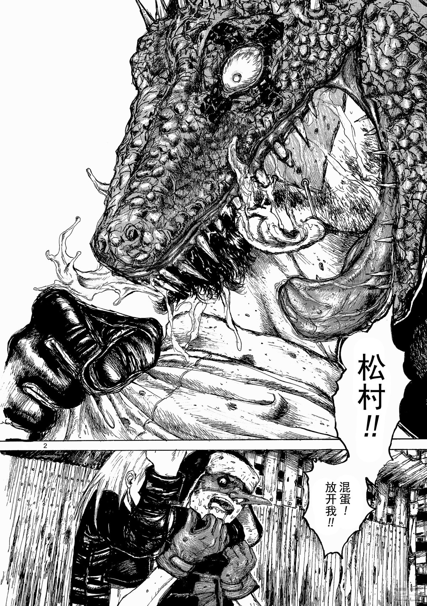
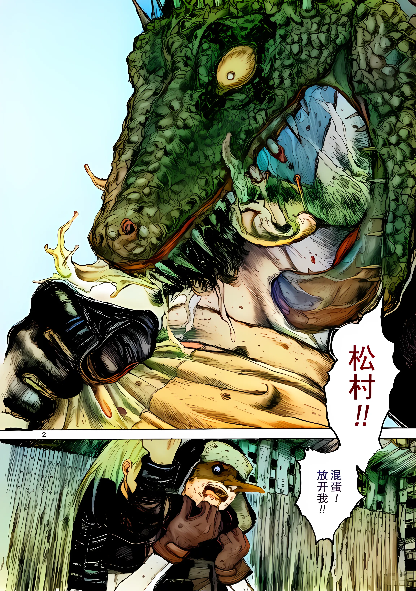

<p align="center">
  
</p>

## <div align="center"><b><a href="README.md">English</a> | <a href="README_CN.md">简体中文</a></b></div>
An amazing manga colorization project  |  漫画AI上色

You can try it in [](https://colab.research.google.com/drive/1TW21OE4jbDkTiHpkPvBsazsCFnsNyAo0?usp=sharing)

If Manga-Colorization-FJ is helpful, please help to ⭐ this repo or recommend it to your friends 😊 <br>
# New features

- [x] Skip color img just copy/sr to output.
- [x] Replace the offered "zipfile" weight to old "pt" format to support pytorch version >=1.0
- [x] Add tile img option for small cuda memory gpu.
- [x] Add Real-ESRGAN (support tile) for output super-resolution.
- [x] Support only SR mode; only Color mode; all Color mode.
- [x] Support Chinese path. 
- [x] Support Sub-folder mode.

# Automatic colorization

1. Download [generator](https://cubeatic.com/index.php/s/PcB4WgBnHXEKJrE). Put 'generator.pt' in `./networks/`
```bash
wget https://cubeatic.com/index.php/s/PcB4WgBnHXEKJrE/download -O ./networks/generator.pt
```
2. Put imgs into "./input/"
3. To colorize image or folder of images, use the following command:

USE CPU:
```
$ python inference.py
```
USE GPU:
```
$ python inference.py -g
```
Only SR mode(no color):
```
$ python inference.py -onlysr
```
Color all mode(no skip color one):
```
$ python inference.py -ca
```
No SR mode(only color):
```
$ python inference.py -nosr
```
Sub-dir mode(handle all sub dir):
```
$ python inference.py -sub
```
4. Colorized image saved to "./output/"

---

# Usage of python script

```
usage: inference.py [-h] [-p PATH] [-op OUTPUTPATH] [-gen GENERATOR]
                    [-sur SURPERPATH] [-ext EXTRACTOR] [-g] [-nd]
                    [-ds DENOISER_SIGMA] [-s SIZE] [-ct COLORTILE]
                    [-st SRTILE] [--tile_pad TILE_PAD] [-nosr] [-ca] [-onlysr]

optional arguments:
  -h, --help            show this help message and exit
  -p PATH, --path PATH  input dir/file
  -op OUTPUTPATH, --outputpath OUTPUTPATH
                        output dir
  -gen GENERATOR, --generator GENERATOR
  -sur SURPERPATH, --surperpath SURPERPATH
  -ext EXTRACTOR, --extractor EXTRACTOR
  -g, --gpu             Use gpu
  -nd, --no_denoise     No denoiser before color
  -ds DENOISER_SIGMA, --denoiser_sigma DENOISER_SIGMA
                        Denoiser_sigma
  -s SIZE, --size SIZE  Color output size
  -ct COLORTILE, --colortile COLORTILE
                        Color Tile size, 0 for no tile
  -st SRTILE, --srtile SRTILE
                        SR Tile size, 0 for no tile
  --tile_pad TILE_PAD   Tile padding
  -nosr, --no_superr    SR or not SR by RealESRGAN_x4plus_anime_6B
                        aftercolored
  -ca, --color_all      colorall images, no skip color one
  -onlysr, --only_sr    only SR all images, no color
  -sub, --all_subdir    handle all input sub folders
```

# Samples

| Original      | Colorization      |
|------------|-------------|
|  |  |
|  |  |
|  |  |
|  |  |
|  |  |
|  |  |

## 🤗 Acknowledgement

Based on https://github.com/qweasdd/manga-colorization-v2

Thx https://github.com/xinntao/Real-ESRGAN
